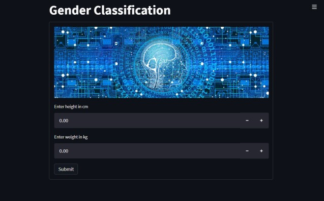
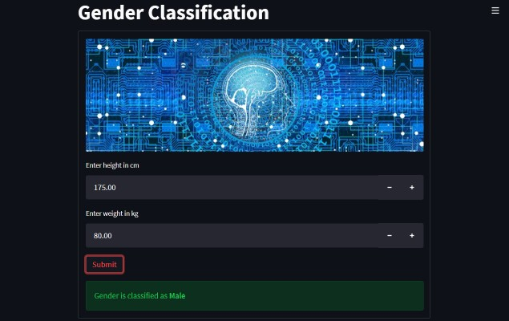
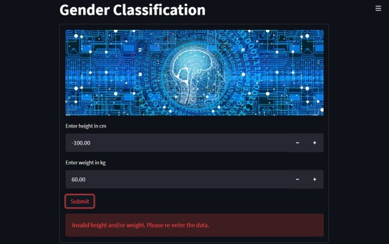

## Introduction
This repository contains the Python script that demonstrates the implementation of a machine learning webapp using Streamlit. The environment and dependencies are now managed using [`uv`](https://github.com/astral-sh/uv), a modern and fast Python package manager.

---

## Getting Started

Follow these instructions to set up and run the project using `uv`.

### Prerequisites

- **Python 3.12 or higher** must be installed on your system. You can download it from [https://www.python.org/downloads/](https://www.python.org/downloads/).
- Install `uv` by following the instructions from the official GitHub page:  
  [https://github.com/astral-sh/uv#installation](https://github.com/astral-sh/uv#installation)

#### Install `uv`

- **Linux/macOS**:
  ```bash
  curl -LsSf https://astral.sh/uv/install.sh | sh
  ```

- **Windows (PowerShell)**:
  ```powershell
  irm https://astral.sh/uv/install.ps1 | iex
  ```

---

## Running the Project

1. The following table lists the Python scripts in this repository and describes their roles.
   | Filename       | Description                                               |
   | :------------- | :-------------------------------------------------------- |
   | train_model.py | Train a logistic regression model and save it             |
   | webapp.py      | Launch a webapp for classiciation using the trained model |
2. Train the model:  
   ```bash
   uv run train_model.py
   ```
3. Run the web application:  
   ```bash
   uv run streamlit run webapp.py
   ```

This command will:
- Automatically create a virtual environment in `.venv` if it doesn't exist
- Install all dependencies from `pyproject.toml` (and `uv.lock` if present)
- Run the script inside the virtual environment

---

# 4. Screenshots




